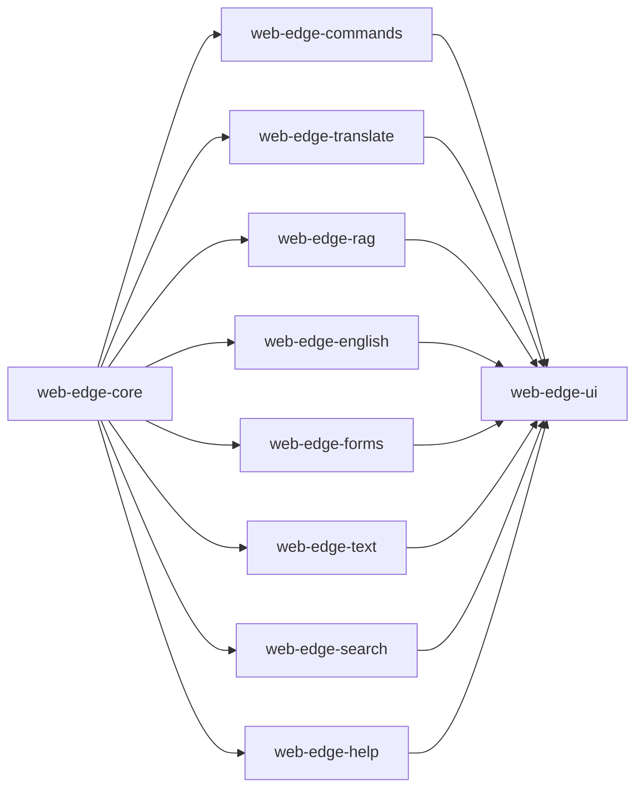

# Architecture

## Dependency Structure

Github Organization: optimaxer_ai

Git repositories (npm libraries) and dependencies:



### web-edge-ui

The `web-edge-ui` library is a comprehensive UI component library that integrates seamlessly with AI-powered features. It provides a wide range of reusable components and utilities to build modern and intuitive user interfaces for web applications. Examples:

AI Settings: The AI Settings component allows users to configure and customize the behavior of AI-powered features in the application. It provides a user-friendly interface to adjust settings such as language preferences, translation options, retrieval-augmented generation (RAG) settings, and more.

AI Toolbar: The AI Toolbar component is a versatile toolbar that offers quick access to various AI-related functionalities. It includes buttons and dropdowns to perform actions like language detection, translation, grammar and spelling checks, form processing, and text analysis. The toolbar can be easily customized to fit the application's design and requirements.

Required Dialogs: The library also includes a set of pre-designed dialogs that are essential for AI-powered interactions. These dialogs cover scenarios such as displaying translation results, showing grammar and spelling suggestions, confirming form submissions, providing feedback on text inputs, and offering contextual help based on user actions. These dialogs are highly customizable and can be easily integrated into the application's workflow.

With the `web-edge-ui` library, developers can leverage the power of AI in their web applications while maintaining a consistent and user-friendly interface. The reusable components and utilities provided by the library simplify the development process and enable the creation of AI-enhanced user experiences.

### web-edge-core

Handles core functionality such as loading models, running inference in web workers, and managing resources.

``` javascript
import { Optimaxer } from 'optimaxer/web-edge-core';

// Mode 1: Local Lightweight LLM using WebGPU
const model = await Optimaxer.loadModel({ model: 'gemma-2b', mode: 'edge' });

// Mode 2: Backend API with Server-side LLM
const model = await Optimaxer.loadModel({ model: 'gemma-7b', mode: 'server' });
```

In the `web-edge-core` library, you can configure the system to operate in two modes. 

In Mode 1, you can use a local lightweight Language Model (LLM) that is loaded onto the browser using WebGPU. This mode is suitable for scenarios where you want to perform inference locally without relying on a backend server.

In Mode 2, you can set up the system to use a backend API that utilizes a Language Model (LLM) deployed on a server. This mode is useful when you want to offload the inference workload to a more powerful server.

By providing these two modes of operation, the `web-edge-core` library offers flexibility in choosing the most suitable setup for your specific requirements.

### web-edge-commands

Provides a command-line interface web applications to execute simple natural language commands. The library can understand the commands like 'open Order 1234', 'show me the latest news', 'create a new task', etc. and execute the corresponding actions by navigating the web routes to load the required pages or perform the necessary operations.

You should configure the library with the entities, actions, and routes to handle the commands. The library can also validate the commands based on the configured validations before executing the actions.

```typescript
interface EntityConfig {
    entity: string;
    actions: string[];
    routes: {
        lookup: (query: string, action: string) => string;
        [action: string]: (...args: string[]) => string;
    };
    validations?: {
        [action: string]: (...args: string[]) => boolean;
    };
    defaultAction?: string;
}
```

Below is an example configuration:

```typescript
let configuration: EntityConfig[] = [
    { 
        entity: 'Order',
        actions: ['view', 'delete', 'edit', 'new'], 
        routes: {
            new: () => 'order/new',
            edit: (id) => `order/edit/${id}`,
            delete: (id) => `order/delete/${id}`,
            view: (id) => `order/view/${id}`,
            lookup: (query, action) => `order/lookup/${query}/next_action/${action}`
        },
        defaultAction: 'view',
        validations: {
            edit: (id) => !isNaN(Number(id)), 
            delete: (id) => !isNaN(Number(id)), 
            view: (id) => !isNaN(Number(id)), 
            lookup: (query, action) => query.length > 0,
        },
    },
    { 
        entity: 'News',
        actions: ['view', 'new'], 
        routes: {
            new: () => 'news/new',
            view: (id) => `news/view/${id}`,
            lookup: (query, action) => `news/lookup/${query}/next_action/${action}`
        },
        defaultAction: 'view',
    },
    { 
        entity: 'Task',
        actions: ['view', 'delete', 'edit', 'new'], 
        routes: {
            new: () => 'task/new',
            edit: (id) => `task/edit/${id}`,
            delete: (id) => `task/delete/${id}`,
            view: (id) => `task/view/${id}`,
            lookup: (query, action) => `task/lookup/${query}/next_action/${action}`
        },
        defaultAction: 'view',
    },
];

```

You can then run the commands using the `CommandRunner` class:

```typescript
import { CommandRunner, EntityConfig } from 'optimaxer/web-edge-commands';

const runner = new CommandRunner();
runner.configure(configuration as EntityConfig[]);

runner.runCommand('show me Order 1234')
    .then((result: string) => {
        console.log(result);
    })
    .catch((error: Error) => {
        console.error(error);
    });
```

- The library will identify the entity, action, and parameters from the command and execute the corresponding route or action based on the configuration.
- In the case where user specify the `id` of the entity, the library will validate the `id` based on the configured validations before executing the action. If the `id` is valid, the library will execute the corresponding action route with the `id` parameter.
- If `id` is not specified the library will see any searchable parameter is provided such as a string and will try to find the entity based on the searchable parameter. In this case, the library will execute the `lookup` route with the searchable parameter and the next action to be executed.
- On the lookup route, the requested action will be available in the `next_action` parameter. This can be used to determine the next action to be executed after the entity is found.

### web-edge-translate

Provides translation services for web applications. The library can do language detection, translate text from one language to another in real-time, enabling users to interact with content in their preferred language.

### web-edge-rag

Provides retrieval-augmented generation (RAG) capabilities for web applications. The library can generate text based on a given prompt and retrieve relevant information from a large document to enhance the generated content.

### web-edge-english

Provides English language processing capabilities for web applications. The library can perform tasks such as grammar and spelling checks to enhance the quality of text inputs and outputs.

### web-edge-forms

Provides form processing capabilities for web applications. The library can auto fill a form by extracting information from a given text, advanced validation of form inputs, suggest corrections, and provide real-time feedback to users to improve the quality of form submissions.

### web-edge-text

Provides text processing capabilities for web applications. The library can perform tasks such as content generation, information extraction, rephrasing, auto complete, summarization, sentiment analysis, and more to enhance the user experience and provide valuable insights from text inputs.

### web-edge-search

Provides search capabilities for web applications. The library can understand natural language queries, formulate a advanced search query without users manually navigating through advanced search fields.

### web-edge-help

Provides contextual help capabilities for web applications. The library can provide real-time assistance based on the current user actions/inputs, offering tips or additional information related to possible next actions, enhancing the user experience and reducing the need for manual learning.
